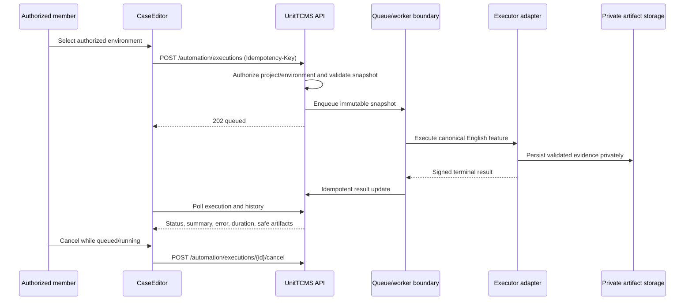
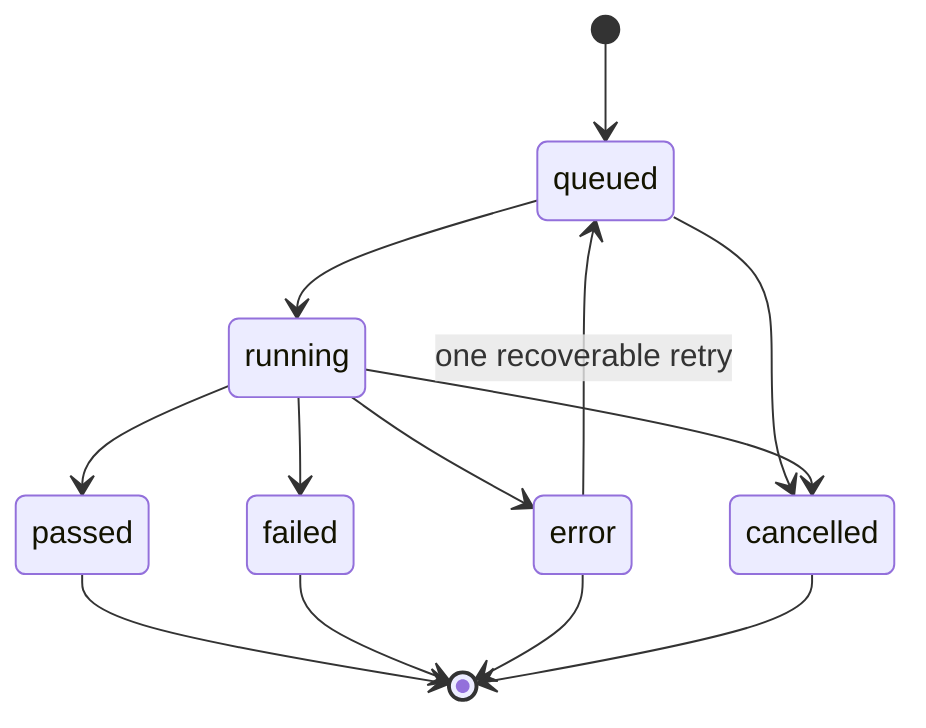

# Gherkin automation

This page describes the final delivery boundary for asynchronous execution of
localized Gherkin cases. The executable source remains the canonical English
`Given`/`When`/`Then` snapshot derived from `Case` and ordered `CaseStep`
records. Localized labels are presentation-only.

:::warning Readiness gate

The repository does **not** claim production readiness until the isolated
compatibility job passes with the pinned image, real evidence, resource limits,
telemetry policy, timeout/cancellation proof, and target allowlist proof. The
default API registry is empty and the default execution mode is `disabled`; an
explicit API `real` override only wires Redis/store/resolver access and does
not prove worker or Hercules readiness.

:::

## First usable flow

1. A project member opens a Gherkin case.
2. The UI loads only enabled environments authorized for that project.
3. The member selects an environment and chooses **Run automatically**.
4. The API stores an immutable snapshot and returns `202` with `queued`.
5. The UI polls the execution and distinguishes `queued` and `running` from
   terminal `passed`, `failed`, `error`, or `cancelled` states.
6. Terminal results show summary, safe error text, duration, execution history,
   and private evidence links. Active executions offer cancellation.

The UI never turns a network error into a functional failure, and it never
allows a client-supplied approval/status field to update a manual `RunCase`.

## Architecture decision record

### ADR-01 — Neutral application boundary

The domain and application layers depend on `AutomationExecutor`,
`ExecutionQueue`, `ArtifactStorage`, `EnvironmentResolver`, and
`ExecutorRegistry`. The external engine is selected by an infrastructure
registry. This keeps the UI/API independent of any executor name or protocol
and permits a second executor without changing canonical snapshots or state
transitions.

### ADR-02 — Immutable snapshot and final-result mapping

Every request binds to the current `Case.automationVersion`, canonical feature,
and SHA-256 snapshot hash. Attempts and prior manual history remain queryable.
Only terminal functional `passed`/`failed` outcomes may update a linked
`RunCase`; `queued`, `running`, `error`, `cancelled`, and invalid events cannot
overwrite approval/status.

### ADR-03 — Private evidence boundary

Evidence is stored under an execution/attempt-scoped private key outside
`backend/public/uploads`. Metadata is limited to kind, MIME type, size, hash,
retention, and storage reference. Downloads require authenticated project
authorization and persisted hash verification. S3/MinIO is an optional seam,
not a required local service.

### ADR-04 — Fail-closed deployment modes

`AUTOMATION_EXECUTION_MODE=disabled` is the safe default. `fake` is a test/dev
injection only and is rejected by the production entrypoint. `real` still
requires the compatibility gate and injected worker/runtime configuration.
Setting `AUTOMATION_PHASE0_READY=true` without the corresponding evidence does
not constitute proof.

## Flow sequence



## Lifecycle state model



Functional assertions are `failed`. Technical faults, timeout, or abandonment
are `error`; only an explicit user cancellation is `cancelled`. A recoverable
technical outcome may create one preserved retry attempt. Connection loss does
not cancel work.

## API and Swagger surface

All endpoints require the existing JWT security scheme and project
authorization. TSOA generates the route and Swagger files during the backend
build; generated files are intentionally ignored by `backend/.gitignore`.

| Method | Endpoint                                                                         | Purpose                                 |
| ------ | -------------------------------------------------------------------------------- | --------------------------------------- |
| `GET`  | `/automation/projects/{projectId}/environments`                                  | List safe, enabled environment metadata |
| `POST` | `/automation/executions`                                                         | Validate, snapshot, and queue (`202`)   |
| `GET`  | `/automation/executions/{executionId}`                                           | Poll one execution                      |
| `GET`  | `/automation/projects/{projectId}/executions?page&limit&status&caseId&runCaseId` | Page/filter history                     |
| `POST` | `/automation/executions/{executionId}/cancel`                                    | Idempotent cancellation                 |
| `GET`  | `/automation/executions/{executionId}/artifacts`                                 | List authorized evidence metadata       |
| `GET`  | `/automation/artifacts/{artifactId}/download`                                    | Return authorized private content       |
| `GET`  | `/automation/health`                                                             | Report executor readiness               |

Errors use `{ "error": "code", "correlationId": "safe-id" }`. Validation
failures may also include bounded `{ "fields": [{ "field", "code", "message" }] }`
diagnostics. Responses never include snapshots, credentials, internal paths, or
cross-project details.

## Artifact format

| Field        | Rule                                                                                                         |
| ------------ | ------------------------------------------------------------------------------------------------------------ |
| `kind`       | Allowlisted evidence category such as `junit`, `html`, `screenshot`, `video`, `log`, `network`, or `planner` |
| `mimeType`   | Validated MIME/extension pair                                                                                |
| `size`       | Bounded before persistence                                                                                   |
| `sha256`     | Calculated on write and checked again on download                                                            |
| `storageKey` | UUID/attempt-scoped private reference; never a public URL                                                    |
| `expiresAt`  | Retention boundary; expired evidence is unavailable                                                          |

Binary content is never placed in a Gherkin snapshot, log, frontend metadata,
or public upload directory. Download responses use an authenticated, private
base64 payload at the current API boundary so the UI can create a local
download without exposing storage.

Each real Hercules invocation receives the four container-only path variables
through Docker's fixed `--env` contract: `PROJECT_SOURCE_ROOT`,
`INPUT_GHERKIN_FILE_PATH`, `JUNIT_XML_BASE_PATH`, and `TEST_DATA_PATH`. A
bind-mounted run uses `/testzeus-hercules/opt` as its project root. A
named-volume run uses the run directory below `AUTOMATION_HERCULES_WORKDIR`,
mapped to the corresponding safe subdirectory under
`/testzeus-hercules/opt`; host paths are never passed as Hercules paths. The
worker creates the run-local `test-data` directory before starting Hercules,
and collection happens before the run workspace is removed. The pinned image's
entrypoint does not forward arguments after the image, so the invocation does
not use the ignored path CLI arguments.

Compatibility proof also requires the path variables to be present at the
process boundary. This keeps a missing or incorrectly wired per-run path from
being treated as readiness evidence.

Compatibility evidence remains fail-closed: `binaryScan.complete` is false
when any binary exceeds the bounded scan window. Execution artifact collection
has one explicit exception for a known Hercules video path so normal videos
can be persisted, while unknown large binaries and suspicious small binaries
still reject the execution. Private artifact storage independently validates
the MIME/extension pair, size, SHA-256, and configured secret values before
writing bytes.

## Configuration and isolated verification

Copy `.env.example` to a local, ignored `.env` and replace placeholders outside
source control. Never commit real credentials.

### Default API stack

`docker compose up -d` starts only `unittcms` and Redis. Compose defaults the
API to `AUTOMATION_EXECUTION_MODE=disabled` and
`AUTOMATION_PHASE0_READY=false`; it does not receive worker LLM variables, a
worker secret, or the Docker socket. An explicit
`AUTOMATION_EXECUTION_MODE=real` in `.env` enables the API's Redis/store/resolver
wiring so project environments can be listed, but it does not start the worker,
bypass Phase 0, or prove execution readiness.

| Variable                    | Safe/default value                       | Meaning                                                           |
| --------------------------- | ---------------------------------------- | ----------------------------------------------------------------- |
| `AUTOMATION_EXECUTION_MODE` | `${AUTOMATION_EXECUTION_MODE:-disabled}` | API defaults fail-closed; explicit `real` enables API wiring only |
| `AUTOMATION_PHASE0_READY`   | `false`                                  | Not evidence and not an API readiness claim                       |
| `AUTOMATION_REDIS_URL`      | `redis://redis:6379`                     | Queue dependency address                                          |
| `AUTOMATION_ARTIFACT_ROOT`  | private volume path                      | Evidence root outside public uploads                              |

### Opt-in worker profile

The worker image is built with the Docker CLI only when the profile is enabled.
The compiled module is `/app/backend/automation/worker-bootstrap.js`, loaded as
`./backend/automation/worker-bootstrap.js` from the application root.

| Variable                        | Safe/default value                         | Meaning                                                                                                  |
| ------------------------------- | ------------------------------------------ | -------------------------------------------------------------------------------------------------------- |
| `AUTOMATION_EXECUTION_MODE`     | `real`                                     | Worker service pins `real`; API mode is opted in separately                                              |
| `AUTOMATION_PHASE0_READY`       | `false`                                    | Worker exits safely until Phase-0 evidence is approved                                                   |
| `AUTOMATION_WORKER_MODULE`      | `./backend/automation/worker-bootstrap.js` | Compiled worker bootstrap                                                                                |
| `AUTOMATION_WORKER_SECRET`      | unset                                      | Non-Compose fallback only; prefer the mounted secret file                                                |
| `AUTOMATION_WORKER_SECRET_FILE` | `/run/secrets/automation_worker_secret`    | Mandatory worker-only HMAC secret file                                                                   |
| `AUTOMATION_SECRETS_DIR_HOST`   | `./.secrets`                               | Read-only host directory mounted only into the worker                                                    |
| `AUTOMATION_HERCULES_WORKDIR`   | private volume path                        | Ephemeral Hercules work directory                                                                        |
| `AUTOMATION_HERCULES_VOLUME`    | `unittcms_hercules-work`                   | Worker-only named volume; each run targets its own workdir-relative container subdirectory               |
| `HERCULES_LLM_PROVIDER`         | `ollama`                                   | `ollama` for the host daemon, `ollama-cloud` for direct Cloud, or `openai-compatible` for keyed gateways |
| `HERCULES_LLM_MODEL`            | exact installed Ollama tag                 | Required local tag or available Cloud model/deployment identifier                                        |
| `LITELLM_BASE_URL`              | `http://host.docker.internal:11434`        | Local daemon/LiteLLM endpoint, or exactly `https://ollama.com/api` for Cloud                             |
| `LITELLM_API_KEY_FILE`          | `/run/secrets/litellm_api_key`             | Required and non-empty for keyed LiteLLM production routes                                               |
| `OLLAMA_API_KEY_FILE`           | `/run/secrets/ollama_api_key`              | Required and non-empty only for the authenticated `ollama-cloud` route                                   |
| `HERCULES_ALLOWED_HOSTS`        | unset                                      | Phase-0 compatibility allowlist; product executions derive the host from the saved project environment   |

The API service and project `TestEnvironment` contain none of the global LLM
credentials. The worker reads and validates this contract only when it starts.
The API publishes jobs through Redis and reads a short-lived worker heartbeat;
it does not construct `HerculesAutomationExecutor` or load the LLM key.
Provider and model are trimmed generic identifiers. The endpoint must be HTTP(S)
without URL credentials; `ollama-cloud` additionally requires the exact
`https://ollama.com/api` endpoint without query parameters or fragments. A keyed
provider's key is trimmed in memory and is never written to a case, canonical
snapshot, database row, API response, log, evidence file, or Docker argument
value. The pinned invocation contains only explicitly inherited variable names.
`LLM_MODEL_API_KEY` is omitted for local keyless `ollama` and is populated for
`ollama-cloud` and other authenticated providers.

The Compose worker requires the local, ignored secrets directory and the worker
secret before it can start. Local keyless Ollama does not require a provider key
file; authenticated profiles use their own file:

- `./.secrets/automation_worker_secret`, mounted read-only at `/run/secrets/automation_worker_secret`
- `./.secrets/ollama_api_key`, mounted at `/run/secrets/ollama_api_key` for `ollama-cloud`
- `./.secrets/litellm_api_key`, mounted at `/run/secrets/litellm_api_key` for a keyed LiteLLM route

PowerShell setup for the mandatory worker secret can read the value without printing it:

```powershell
New-Item -ItemType Directory -Force .secrets | Out-Null
function Write-ComposeSecret([string]$Path, [string]$Prompt) {
  $secure = Read-Host $Prompt -AsSecureString
  $pointer = [Runtime.InteropServices.Marshal]::SecureStringToBSTR($secure)
  try {
    $fullPath = [IO.Path]::GetFullPath((Join-Path (Get-Location) $Path))
    [IO.File]::WriteAllText($fullPath, [Runtime.InteropServices.Marshal]::PtrToStringBSTR($pointer))
  } finally {
    [Runtime.InteropServices.Marshal]::ZeroFreeBSTR($pointer)
  }
  Remove-Variable secure
}
Write-ComposeSecret '.secrets/automation_worker_secret' 'Automation worker secret'
# For direct Ollama Cloud only:
# Write-ComposeSecret '.secrets/ollama_api_key' 'Ollama Cloud API key'
# For a keyed LiteLLM provider only:
# Write-ComposeSecret '.secrets/litellm_api_key' 'LiteLLM API key'
```

Start the safe default stack with:

```powershell
Copy-Item .env.example .env
$env:SECRET_KEY = [guid]::NewGuid().ToString('N')
docker compose --env-file .env up -d
```

For the explicit API wiring opt-in, set `AUTOMATION_EXECUTION_MODE=real` in
the ignored `.env` file and recreate the base stack with:

```powershell
docker compose --env-file .env up -d --build
```

The configured project environments can then be loaded by the API, but jobs
remain not ready until the separate worker is running and reporting a valid
heartbeat.

The opt-in command is:

```powershell
$env:AUTOMATION_PHASE0_READY = 'false'
docker compose --env-file .env --profile automation-worker up -d --build
```

The worker fails with a safe `automation_phase0_not_ready` message while the
gate is false. Set the process value to `true` only after the independent
Phase-0 compatibility evidence is approved, then rerun the same profile
command. This enables consumption; it does not prove Hercules or LLM
readiness.

The worker alone mounts `/var/run/docker.sock` read-only because the pinned
executor invokes the host Docker CLI. A read-only socket mount does not make the
Docker API read-only: it grants powerful host-daemon control. Enable the
profile only on a trusted machine and keep it explicitly opt-in.

`GET /api/health/` proves only API liveness. Successful automation readiness
would require `GET /api/automation/health` to report `ready: true`,
`phase0Ready: true`, and a ready `hercules` executor backed by a live Redis
heartbeat. This work unit does not run Docker, Hercules, or an LLM and makes no
real-readiness claim.

For local Ollama, no provider key is needed:

```bash
export HERCULES_LLM_PROVIDER=ollama
export HERCULES_LLM_MODEL=replace-with-exact-installed-ollama-tag
export LITELLM_BASE_URL=http://host.docker.internal:11434
unset LITELLM_API_KEY
```

For direct Ollama Cloud, use the official API endpoint and the worker-only key
file:

```bash
export HERCULES_LLM_PROVIDER=ollama-cloud
export HERCULES_LLM_MODEL=replace-with-ollama-cloud-model
export LITELLM_BASE_URL=https://ollama.com/api
export OLLAMA_API_KEY_FILE=/run/secrets/ollama_api_key
```

Create `.secrets/ollama_api_key` before starting the Compose worker. For local
non-production tests without Compose, unset `OLLAMA_API_KEY_FILE` and use
`OLLAMA_API_KEY` instead; production requires `OLLAMA_API_KEY_FILE`.

For a keyed local worker, use a file outside source control rather than putting
a key in `.env`:

```bash
mkdir -p .secrets
printf '%s\n' '<local-development-key>' > .secrets/litellm_api_key
chmod 600 .secrets/litellm_api_key
export LITELLM_API_KEY_FILE="$PWD/.secrets/litellm_api_key"
export HERCULES_LLM_PROVIDER=openai-compatible
export HERCULES_LLM_MODEL=replace-with-approved-model
export LITELLM_BASE_URL=https://replace-with-approved-litellm-endpoint/v1
```

The explicit `LITELLM_API_KEY` environment fallback exists only for local
development tests of keyed LiteLLM providers. The equivalent `OLLAMA_API_KEY`
fallback is only for non-production tests of `ollama-cloud`. Production workers
fail closed unless the provider-specific file is readable and non-empty; local
keyless Ollama does not read or pass either optional provider key. A configured
provider/model/endpoint does not prove Hercules readiness; the Phase-0
compatibility evidence and the separate worker gate are still required.

The pinned compatibility image is:

```text
testzeus/hercules:0.1.2@sha256:11ff3700104f92230bafdff1e85f43b8932e8a7df5ab85b7f7d00d3cea61f52c
```

Run the fake/injected browser smoke path locally with:

```bash
npm run e2e:gherkin:fake
```

The real browser/LLM path is intentionally isolated and opt-in:

```bash
UNITTCMS_HERCULES_COMPAT_REAL=1 \
LLM_MODEL_API_TYPE=ollama \
LLM_MODEL_NAME="$HERCULES_LLM_MODEL" \
LLM_MODEL_BASE_URL="$LITELLM_BASE_URL" \
LLM_MODEL_CLIENT_HOST="$LITELLM_BASE_URL" \
HERCULES_ALLOWED_HOSTS=example.com \
npm run hercules:compatibility:real
```

The GitHub workflow requires a manual boolean approval, pinned image contract,
LLM/LiteLLM variables from Actions secrets, and the Phase-0 target allowlist
from an Actions variable. Product executions do not consume this global value;
they derive the host from the saved project environment. No real browser or LLM
run is part of normal CI.

## Adding a second executor

1. Implement `AutomationExecutor` in `backend/automation/infrastructure/<name>`.
2. Accept only `ExecutorInput` and return neutral `ExecutorResult` values.
3. Keep credentials, process arguments, cancellation, limits, and evidence
   parsing inside that infrastructure adapter.
4. Register it explicitly in an injected `ExecutorRegistry`; do not register a
   fake or real engine from the default API application.
5. Add adapter tests for fixed arguments, timeout/cancellation, result mapping,
   and secret absence.
6. Add a separate readiness proof and deployment configuration before enabling
   it. Do not add engine names, imports, or protocol types to domain,
   application, API, or UI code.

## Operations and troubleshooting

### Health and readiness

- `GET /api/health/` proves only that the API responds.
- `GET /api/automation/health` proves whether an injected executor is ready.
- `queued` with no worker usually means the queue/worker dependency is not
  configured or healthy; inspect Redis/worker heartbeat and correlation ID.
- The compose worker profile is an explicit loader for an injected real worker
  module. It refuses `disabled`/`fake` modes and refuses to start without
  `AUTOMATION_WORKER_MODULE`; this repository does not silently install a
  production mock or claim a BullMQ adapter that has not been supplied.
- `not_ready` is expected while the compatibility proof or real registry is
  absent. Do not switch to `fake` in production to make health green.

### Common incidents

| Symptom                       | Check                                                         | Safe action                                                            |
| ----------------------------- | ------------------------------------------------------------- | ---------------------------------------------------------------------- |
| Environment list is empty     | Project membership, enabled flag, API readiness               | Fix authorization/configuration; do not expose base URL or secret refs |
| Execution remains queued      | Redis health and worker heartbeat                             | Reconcile stalled jobs; preserve the execution ID and attempt history  |
| Execution is `error`          | Correlation ID, bounded worker logs, timeout/resource limits  | Retry only if the error is explicitly recoverable                      |
| Evidence download fails       | Retention, project membership, persisted hash                 | Keep the artifact private and report a safe error                      |
| Docker container is unhealthy | `/api/health/`, migration output, database volume permissions | Correct dependency readiness before restarting                         |

Logs and metrics may contain correlation ID, execution ID, attempt, project ID,
engine, status, lag, duration, retry count, and health. They must not contain
API keys, secret values, authorization headers, snapshots with credentials, or
binary evidence.

## Pre-existing dependencies, risks, and future work

- Legacy attachment authorization remains a pre-existing dependency; the
  automation feature does not reuse or silently repair attachment routes.
- The legacy Sequelize association involving lowercase `models.folder` remains
  a pre-existing dependency and is not silently fixed here.
- DNS resolution and outbound egress enforcement are not fully proven by the
  current literal-host checks. Do not claim complete SSRF safety until a
  resolver/egress boundary is deployed and tested.
- The current local stack keeps MinIO/S3 optional behind `ArtifactStorage`; the
  file seam is used for focused tests and private local evidence.
- Future work includes a production BullMQ/Redis adapter, a concrete secret
  provider, DNS/egress enforcement, and a completed isolated Hercules gate.

### Rollback

Disable automation routes/UI and stop the worker/queue profile. Retain manual
cases and `RunCase` history. Keep private evidence under its retention policy,
then remove the UI, adapter, queue wiring, and migration in reverse dependency
order. Never migrate evidence into `backend/public/uploads` during rollback.
