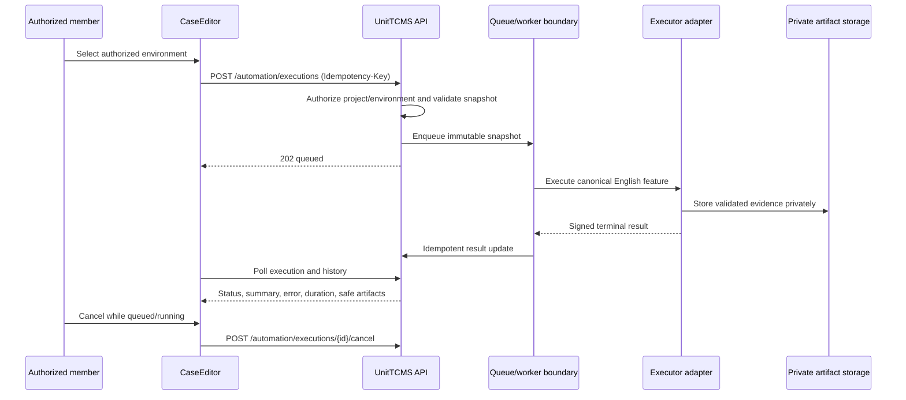
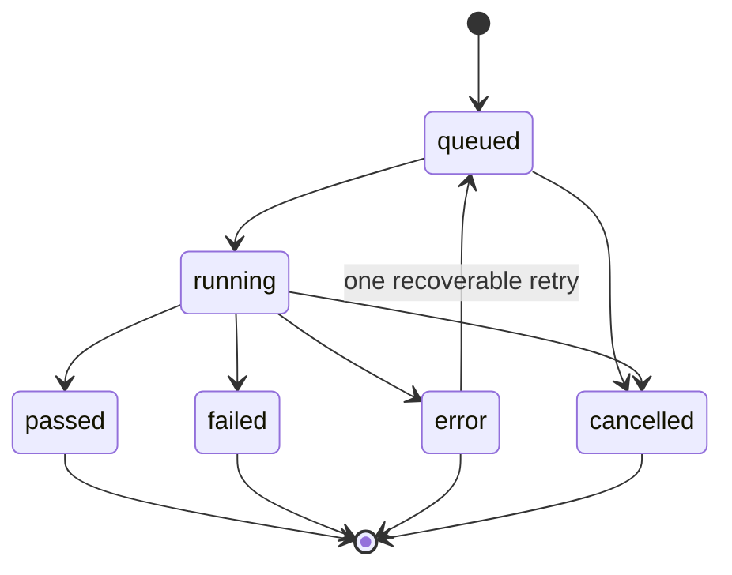

# Gherkin automation

This page describes the final delivery boundary for asynchronous execution of
localized Gherkin cases. The executable source remains the canonical English
`Given`/`When`/`Then` snapshot derived from `Case` and ordered `CaseStep`
records. Localized labels are presentation-only.

:::warning Readiness gate

The repository does **not** claim production readiness until the isolated
compatibility job passes with the pinned image, real evidence, resource limits,
telemetry policy, timeout/cancellation proof, and target allowlist proof. The
default API registry is empty and the default execution mode is `disabled`.

:::

## First usable flow

1. A project member opens a Gherkin case.
2. The UI loads only enabled environments authorized for that project.
3. The member selects an environment and chooses **Run automatically**.
4. The API stores an immutable snapshot and returns `202` with `queued`.
5. The UI polls the execution and distinguishes `queued` and `running` from
   terminal `passed`, `failed`, `error`, or `cancelled` states.
6. Terminal results show summary, safe error text, duration, execution history,
   and private evidence links. Active executions offer cancellation.

The UI never turns a network error into a functional failure, and it never
allows a client-supplied approval/status field to update a manual `RunCase`.

## Architecture decision record

### ADR-01 — Neutral application boundary

The domain and application layers depend on `AutomationExecutor`,
`ExecutionQueue`, `ArtifactStorage`, `EnvironmentResolver`, and
`ExecutorRegistry`. The external engine is selected by an infrastructure
registry. This keeps the UI/API independent of any executor name or protocol
and permits a second executor without changing canonical snapshots or state
transitions.

### ADR-02 — Immutable snapshot and final-result mapping

Every request binds to the current `Case.automationVersion`, canonical feature,
and SHA-256 snapshot hash. Attempts and prior manual history remain queryable.
Only terminal functional `passed`/`failed` outcomes may update a linked
`RunCase`; `queued`, `running`, `error`, `cancelled`, and invalid events cannot
overwrite approval/status.

### ADR-03 — Private evidence boundary

Evidence is stored under an execution/attempt-scoped private key outside
`backend/public/uploads`. Metadata is limited to kind, MIME type, size, hash,
retention, and storage reference. Downloads require authenticated project
authorization and persisted hash verification. S3/MinIO is an optional seam,
not a required local service.

### ADR-04 — Fail-closed deployment modes

`AUTOMATION_EXECUTION_MODE=disabled` is the safe default. `fake` is a test/dev
injection only and is rejected by the production entrypoint. `real` still
requires the compatibility gate and injected worker/runtime configuration.
Setting `AUTOMATION_PHASE0_READY=true` without the corresponding evidence does
not constitute proof.

## Flow sequence



## Lifecycle state model



Functional assertions are `failed`. Technical faults, timeout, or abandonment
are `error`; only an explicit user cancellation is `cancelled`. A recoverable
technical outcome may create one preserved retry attempt. Connection loss does
not cancel work.

## API and Swagger surface

All endpoints require the existing JWT security scheme and project
authorization. TSOA generates the route and Swagger files during the backend
build; generated files are intentionally ignored by `backend/.gitignore`.

| Method | Endpoint                                                               | Purpose                                 |
| ------ | ---------------------------------------------------------------------- | --------------------------------------- |
| `GET`  | `/automation/projects/{projectId}/environments`                        | List safe, enabled environment metadata |
| `POST` | `/automation/executions`                                               | Validate, snapshot, and queue (`202`)   |
| `GET`  | `/automation/executions/{executionId}`                                 | Poll one execution                      |
| `GET`  | `/automation/projects/{projectId}/executions?page&limit&status&caseId` | Page/filter history                     |
| `POST` | `/automation/executions/{executionId}/cancel`                          | Idempotent cancellation                 |
| `GET`  | `/automation/executions/{executionId}/artifacts`                       | List authorized evidence metadata       |
| `GET`  | `/automation/artifacts/{artifactId}/download`                          | Return authorized private content       |
| `GET`  | `/automation/health`                                                   | Report executor readiness               |

Errors use `{ "error": "code", "correlationId": "safe-id" }`. They do not
include snapshots, credentials, internal paths, or cross-project details.

## Artifact format

| Field        | Rule                                                                                                         |
| ------------ | ------------------------------------------------------------------------------------------------------------ |
| `kind`       | Allowlisted evidence category such as `junit`, `html`, `screenshot`, `video`, `log`, `network`, or `planner` |
| `mimeType`   | Validated MIME/extension pair                                                                                |
| `size`       | Bounded before persistence                                                                                   |
| `sha256`     | Calculated on write and checked again on download                                                            |
| `storageKey` | UUID/attempt-scoped private reference; never a public URL                                                    |
| `expiresAt`  | Retention boundary; expired evidence is unavailable                                                          |

Binary content is never placed in a Gherkin snapshot, log, frontend metadata,
or public upload directory. Download responses use an authenticated, private
base64 payload at the current API boundary so the UI can create a local
download without exposing storage.

## Configuration and isolated verification

Copy `.env.example` to a local, ignored `.env` and replace placeholders outside
source control. Never commit real credentials.

| Variable                    | Safe/default value   | Meaning                                                                        |
| --------------------------- | -------------------- | ------------------------------------------------------------------------------ |
| `AUTOMATION_EXECUTION_MODE` | `disabled`           | `disabled`, test/dev-only `fake`, or gated `real`                              |
| `AUTOMATION_PHASE0_READY`   | `false`              | Deployment signal; not evidence by itself                                      |
| `AUTOMATION_REDIS_URL`      | `redis://redis:6379` | Queue dependency address                                                       |
| `AUTOMATION_ARTIFACT_ROOT`  | private volume path  | Evidence root outside public uploads                                           |
| `AUTOMATION_WORKER_MODULE`  | unset                | External worker bootstrap; required only for the optional worker profile       |
| `LITELLM_BASE_URL`          | unset                | Injected only into isolated real execution                                     |
| `LITELLM_API_KEY`           | unset                | CI secret; never source, logs, or fixtures                                     |
| `HERCULES_ALLOWED_HOSTS`    | unset                | Explicit target allowlist; `example.test` is required by the canonical fixture |

The pinned compatibility image is:

```text
testzeus/hercules:0.1.2@sha256:11ff3700104f92230bafdff1e85f43b8932e8a7df5ab85b7f7d00d3cea61f52c
```

Run the fake/injected browser smoke path locally with:

```bash
npm run e2e:gherkin:fake
```

The real browser/LLM path is intentionally isolated and opt-in:

```bash
UNITTCMS_HERCULES_COMPAT_REAL=1 \
LITELLM_BASE_URL="$LITELLM_BASE_URL" \
LITELLM_API_KEY="$LITELLM_API_KEY" \
HERCULES_ALLOWED_HOSTS=example.test \
npm run hercules:compatibility:real
```

The GitHub workflow requires a manual boolean approval, pinned image contract,
LLM/LiteLLM variables from Actions secrets, and the target allowlist from an
Actions variable. No real browser or LLM run is part of normal CI.

## Adding a second executor

1. Implement `AutomationExecutor` in `backend/automation/infrastructure/<name>`.
2. Accept only `ExecutorInput` and return neutral `ExecutorResult` values.
3. Keep credentials, process arguments, cancellation, limits, and evidence
   parsing inside that infrastructure adapter.
4. Register it explicitly in an injected `ExecutorRegistry`; do not register a
   fake or real engine from the default API application.
5. Add adapter tests for fixed arguments, timeout/cancellation, result mapping,
   and secret absence.
6. Add a separate readiness proof and deployment configuration before enabling
   it. Do not add engine names, imports, or protocol types to domain,
   application, API, or UI code.

## Operations and troubleshooting

### Health and readiness

- `GET /api/health/` proves only that the API responds.
- `GET /api/automation/health` proves whether an injected executor is ready.
- `queued` with no worker usually means the queue/worker dependency is not
  configured or healthy; inspect Redis/worker heartbeat and correlation ID.
- The compose worker profile is an explicit loader for an injected real worker
  module. It refuses `disabled`/`fake` modes and refuses to start without
  `AUTOMATION_WORKER_MODULE`; this repository does not silently install a
  production mock or claim a BullMQ adapter that has not been supplied.
- `not_ready` is expected while the compatibility proof or real registry is
  absent. Do not switch to `fake` in production to make health green.

### Common incidents

| Symptom                       | Check                                                         | Safe action                                                            |
| ----------------------------- | ------------------------------------------------------------- | ---------------------------------------------------------------------- |
| Environment list is empty     | Project membership, enabled flag, API readiness               | Fix authorization/configuration; do not expose base URL or secret refs |
| Execution remains queued      | Redis health and worker heartbeat                             | Reconcile stalled jobs; preserve the execution ID and attempt history  |
| Execution is `error`          | Correlation ID, bounded worker logs, timeout/resource limits  | Retry only if the error is explicitly recoverable                      |
| Evidence download fails       | Retention, project membership, persisted hash                 | Keep the artifact private and report a safe error                      |
| Docker container is unhealthy | `/api/health/`, migration output, database volume permissions | Correct dependency readiness before restarting                         |

Logs and metrics may contain correlation ID, execution ID, attempt, project ID,
engine, status, lag, duration, retry count, and health. They must not contain
API keys, secret values, authorization headers, snapshots with credentials, or
binary evidence.

## Pre-existing dependencies, risks, and future work

- Legacy attachment authorization remains a pre-existing dependency; the
  automation feature does not reuse or silently repair attachment routes.
- The legacy Sequelize association involving lowercase `models.folder` remains
  a pre-existing dependency and is not silently fixed here.
- DNS resolution and outbound egress enforcement are not fully proven by the
  current literal-host checks. Do not claim complete SSRF safety until a
  resolver/egress boundary is deployed and tested.
- The current local stack keeps MinIO/S3 optional behind `ArtifactStorage`; the
  file seam is used for focused tests and private local evidence.
- Future work includes a production BullMQ/Redis adapter, a concrete secret
  provider, DNS/egress enforcement, and a completed isolated Hercules gate.

### Rollback

Disable automation routes/UI and stop the worker/queue profile. Retain manual
cases and `RunCase` history. Keep private evidence under its retention policy,
then remove the UI, adapter, queue wiring, and migration in reverse dependency
order. Never migrate evidence into `backend/public/uploads` during rollback.
